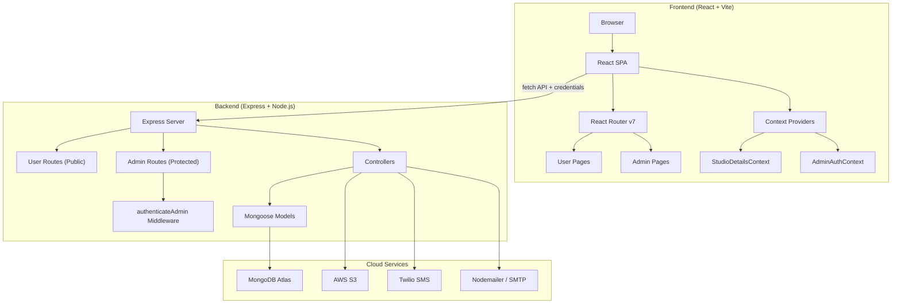
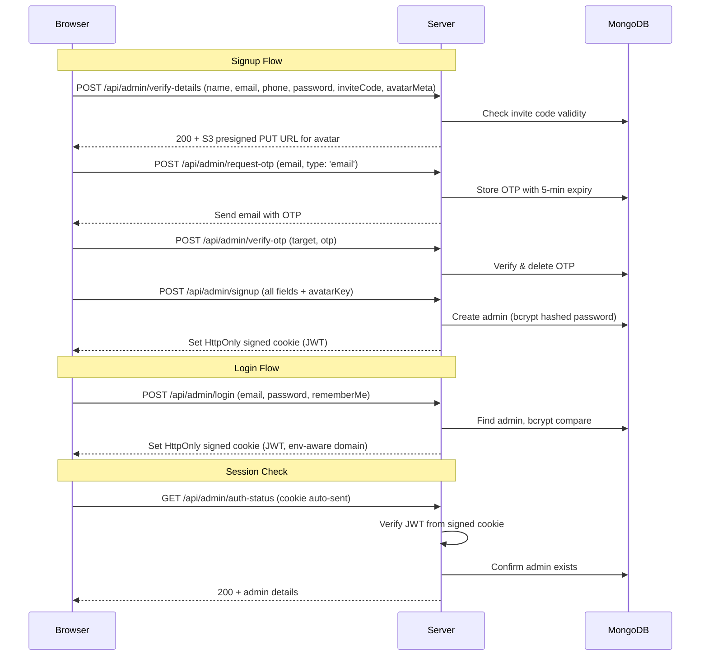

# 🎬 The Wedding Boys — Complete Project Analysis

> **Domain**: [theweddingboys.in](https://theweddingboys.in)
> **Project Root**: `/Users/akshaysingh/Documents/WebDev/web/weddingBoys`
> **Author**: Akshay Singh
> **Architecture**: MERN Monorepo (MongoDB · Express · React · Node.js)

---

## Table of Contents

1. [Executive Summary](#1-executive-summary)
2. [Project Structure & Architecture](#2-project-structure--architecture)
3. [Technology Stack (Full Breakdown)](#3-technology-stack-full-breakdown)
4. [Frontend Deep Dive](#4-frontend-deep-dive)
   - 4.1 [Entry Points & Configuration](#41-entry-points--configuration)
   - 4.2 [Routing Architecture](#42-routing-architecture)
   - 4.3 [User-Facing Pages](#43-user-facing-pages)
   - 4.4 [Admin Panel Pages](#44-admin-panel-pages)
   - 4.5 [Shared Components](#45-shared-components)
   - 4.6 [Context Providers (State Management)](#46-context-providers-state-management)
   - 4.7 [Custom Hooks](#47-custom-hooks)
   - 4.8 [Utility Modules](#48-utility-modules)
   - 4.9 [Static Assets](#49-static-assets)
5. [Backend Deep Dive](#5-backend-deep-dive)
   - 5.1 [Server Entry & Configuration](#51-server-entry--configuration)
   - 5.2 [Database Models (Mongoose Schemas)](#52-database-models-mongoose-schemas)
   - 5.3 [API Routes (Full Catalog)](#53-api-routes-full-catalog)
   - 5.4 [Controllers](#54-controllers)
   - 5.5 [Middleware](#55-middleware)
   - 5.6 [Utilities](#56-utilities)
6. [Design System & Theming](#6-design-system--theming)
7. [SEO & Structured Data](#7-seo--structured-data)
8. [Infrastructure & Hosting](#8-infrastructure--hosting)
9. [Security Architecture](#9-security-architecture)
10. [Non-Functional Analysis](#10-non-functional-analysis)
11. [Known Bugs & Issues](#11-known-bugs--issues)
12. [Environment Variables Reference](#12-environment-variables-reference)
13. [File-Level Inventory](#13-file-level-inventory)

---

## 1. Executive Summary

**The Wedding Boys** is a premium, client-facing website for a wedding cinematography and photography studio based in Mumbai, India. It is a full-stack MERN application with two distinct user surfaces:

| Surface | Purpose |
|---------|---------|
| **Public Website** (`/`) | Showcases wedding films, photo galleries, team info, client reviews, interactive maps, pricing packages, and a contact/enquiry form |
| **Admin Panel** (`/admin/*`) | CMS-style dashboard for managing clients, uploading media to AWS S3, managing tags, reviews, team images, blog posts, studio settings, and viewing enquiries |

### Business Features at a Glance
- 🎥 Cinematic wedding film showcases with a custom-built video player
- 📸 Masonry photo galleries with infinite scroll
- 🗺️ Interactive map (Leaflet) displaying wedding shoot locations across India
- ⭐ Client review management
- 📦 Tiered pricing packages
- 📝 Blog/CMS system with rich-text editor (Tiptap)
- 📩 Enquiry form with email notifications (Nodemailer)
- 🔐 Invite-code-based admin signup with OTP verification (Email via Nodemailer + SMS via Twilio)
- 🌐 Dedicated Varanasi destination-wedding landing page
- 🎪 Dharaa Event Management sub-service page

---

## 2. Project Structure & Architecture

```
weddingBoys/                          ← Monorepo root
├── package.json                      ← Root dependencies (Tiptap editor libs)
├── readme.md                         ← Project documentation
├── .gitignore                        ← Ignores node_modules, .env, build
│
├── Frontend/                         ← React SPA (Vite)
│   ├── index.html                    ← HTML shell with SEO meta, structured data
│   ├── package.json                  ← Frontend dependencies
│   ├── vite.config.mjs               ← Vite config (React plugin, host: true)
│   ├── tailwind.config.js            ← Tailwind CSS customizations
│   ├── postcss.config.js             ← PostCSS config (Tailwind + Autoprefixer)
│   ├── .env                          ← VITE_API_URL (dev)
│   ├── .env.production               ← VITE_API_URL (prod)
│   ├── public/                       ← Static assets (favicons, OG images, frame sequences)
│   └── src/
│       ├── main.jsx                  ← App entry (BrowserRouter, ScrollOnTop)
│       ├── App.jsx                   ← Root component with routing
│       ├── App.css                   ← Shimmer animations, CSS vars
│       ├── index.css                 ← Tailwind directives, custom range slider
│       ├── Asset/                    ← Bundled images, SVGs, video
│       ├── Component/                ← Shared reusable components (10 files)
│       ├── Context/                  ← React Contexts (2 providers)
│       ├── Hooks/                    ← Custom hooks (1 hook)
│       ├── Pages/
│       │   ├── User/                 ← Public pages (9 page directories)
│       │   └── Admin/                ← Admin pages (6 directories + auth)
│       └── Utils/                    ← Static data (Indian locations)
│
└── Backend/                          ← Express API Server
    ├── app.js                        ← Server entry (Express, CORS, routes)
    ├── constants.js                  ← Cookie name constants
    ├── package.json                  ← Backend dependencies
    ├── .env                          ← All secrets (Mongo URI, AWS, JWT, Twilio, Email)
    ├── Config/
    │   └── DBconnection.js           ← Mongoose connection with graceful shutdown
    ├── Controllers/                  ← Business logic (7 controllers)
    ├── Middleware/                    ← Auth + file upload middleware (2 files)
    ├── Models/                       ← Mongoose schemas (11 models)
    ├── Routes/
    │   ├── Admin/                    ← Protected admin routes (11 route files)
    │   └── User/                     ← Public user routes (7 route files)
    └── Utils/                        ← Helpers (4 files: OTP, token, invite code, validator)
```

### Architecture Diagram



---

## 3. Technology Stack (Full Breakdown)

### Frontend

| Category | Technology | Version | Purpose |
|----------|-----------|---------|---------|
| **Core** | React | ^18.2.0 | UI Library |
| **Build** | Vite | ^7.0.0 | Dev server & bundler |
| **Routing** | react-router-dom | ^7.0.2 | Client-side SPA routing |
| **Styling** | Tailwind CSS | ^3.4.16 | Utility-first CSS |
| **Animation** | Framer Motion | ^12.38.0 | Declarative animations |
| **Animation** | GSAP | ^3.15.0 | Advanced timeline animations |
| **Smooth Scroll** | Lenis | ^1.3.23 | Smooth-scroll library |
| **Maps** | React-Leaflet | ^4.2.1 | Interactive maps |
| **Icons** | react-icons | ^5.5.0 | Icon library |
| **Icons** | lucide-react | ^0.523.0 | Additional icon set |
| **Rich Text** | Tiptap (full suite) | ^2.22.3 | WYSIWYG editor (blogs) |
| **Rich Text** | react-quill | ^2.0.0 | Alternative rich-text editor |
| **Rich Text** | TinyMCE React | ^6.2.1 | Another editor option |
| **Layout** | react-masonry-css | ^1.0.16 | Masonry grid layout |
| **Layout** | react-responsive-masonry | ^2.6.0 | Responsive masonry |
| **Scroll** | react-infinite-scroll-component | ^6.1.0 | Infinite scroll for galleries |
| **Scroll** | react-scroll | ^1.9.3 | Smooth scroll to anchors |
| **Observer** | react-intersection-observer | ^9.16.0 | Viewport intersection detection |
| **Counter** | react-countup | ^6.5.3 | Animated number counters |
| **Responsive** | react-responsive | ^10.0.1 | Media query hooks |
| **Alerts** | sweetalert2 | ^11.15.2 | Toast & modal notifications |
| **Slug** | slugify | ^1.6.6 | URL slug generation |
| **Scrollbar** | tailwind-scrollbar | ^3.1.0 | Custom scrollbar styling |
| **Testing** | @testing-library/react | ^14.0.0 | Component testing (CRA legacy) |

### Backend

| Category | Technology | Version | Purpose |
|----------|-----------|---------|---------|
| **Runtime** | Node.js | — | Server runtime |
| **Framework** | Express | ^4.21.2 | HTTP framework |
| **Database** | Mongoose | ^8.9.0 | MongoDB ODM |
| **Auth** | jsonwebtoken | ^9.0.2 | JWT token generation/verification |
| **Auth** | bcrypt | ^5.1.1 | Password hashing |
| **Storage** | @aws-sdk/client-s3 | ^3.717.0 | AWS S3 operations |
| **Storage** | @aws-sdk/s3-request-presigner | ^3.717.0 | S3 presigned URLs |
| **Storage** | aws-sdk | ^2.1692.0 | Legacy AWS SDK (redundant) |
| **Storage** | cloudinary | ^2.5.1 | Cloud image management |
| **Upload** | multer | ^1.4.5 | Multipart file upload |
| **SMS** | twilio | ^5.4.0 | OTP via SMS |
| **Email** | nodemailer | ^6.9.16 | OTP via email |
| **ID Gen** | nanoid | ^5.0.9 | Unique filename generation |
| **ID Gen** | uuid | ^11.0.3 | UUID generation for S3 keys |
| **Validation** | express-validator | ^7.2.0 | Request validation |
| **Slug** | slugify | ^1.6.6 | Blog URL slugification |
| **Env** | dotenv | ^16.4.7 | Environment variable loading |
| **Dev** | nodemon | ^3.1.9 | Hot-reload dev server |

---

## 4. Frontend Deep Dive

### 4.1 Entry Points & Configuration

#### [main.jsx](file:///Users/akshaysingh/Documents/WebDev/web/weddingBoys/Frontend/src/main.jsx)
- Wraps `<App />` in `<BrowserRouter>` for client-side routing
- Includes `<ScrollOnTop />` component to auto-scroll on route changes
- Renders into `#root` div

#### [vite.config.mjs](file:///Users/akshaysingh/Documents/WebDev/web/weddingBoys/Frontend/vite.config.mjs)
- Uses `@vitejs/plugin-react`
- `server.host: true` — exposes dev server on all network interfaces

#### [tailwind.config.js](file:///Users/akshaysingh/Documents/WebDev/web/weddingBoys/Frontend/tailwind.config.js)
Custom design system:
- **Custom breakpoints**: `sm: 50px` (very small!), `md: 720px`, `lg: 970px`, `xl: 1280px`, `2xl: 1536px`
- **Brand colors**: Primary background `#FFF7EE`, accents `#E5BDA7`, `#FAD7A0`, `#74583E`, `#5E6572`
- **Typography**: Oxygen, Playfair Display, Lato, Cinzel, Great Vibes, DM Serif Display, Lora
- **Typography scale**: 3-tier responsive system (mobile/tablet/desktop) for headlines and body

#### [index.html](file:///Users/akshaysingh/Documents/WebDev/web/weddingBoys/Frontend/index.html)
Comprehensive SEO setup:
- Meta tags (title, description, keywords, robots)
- Open Graph tags for Facebook sharing
- Twitter Card tags
- JSON-LD structured data (Organization, VideoObject, VideoProductionService)
- Favicon set (16x16, 32x32, apple-touch)
- Web manifest
- Font preloading (Cinzel, Inter)
- DNS prefetch for CDNs

---

### 4.2 Routing Architecture

#### [App.jsx](file:///Users/akshaysingh/Documents/WebDev/web/weddingBoys/Frontend/src/App.jsx)

The app splits into two rendering paths based on `location.pathname.startsWith('/admin')`:

**User Routes (Public)**:
| Path | Component | Description |
|------|-----------|-------------|
| `/` | `<Home />` | Main landing page |
| `/varanasi` | `<Vanarasi />` | Varanasi destination-wedding page |
| `/films/*` | `<FilmsRoute />` | Film listing & individual films |
| `/allfilms` | `<AllFilms />` | All films listing |
| `/photos/*` | `<Photos />` | Photo gallery & individual albums |
| `/search-result` | `<Search />` | Search results (query param based) |
| `/contact` | `<Contact />` | Enquiry form + WhatsApp CTA |
| `/team` | `<Team />` | Team member showcase |
| `/about-us` | `<AboutPage />` | About the studio |
| `/dharaa-event-management` | `<DharaaEventManagement />` | Dharaa Events sub-service |
| `*` | `<NotFound />` | 404 fallback |

**Admin Routes (Protected)**:
| Path | Component | Description |
|------|-----------|-------------|
| `/admin/login` | `<Login />` | Admin login |
| `/admin/signup` | `<Signup />` | Admin signup (invite code required) |
| `/admin/forgot-password` | `<ForgotPassword />` | Password reset flow |
| `/admin/dashboard` | `<Dashboard />` | Main dashboard |
| `/admin/blogs` | `<BlogList />` | Blog list management |
| `/admin/studio-setting` | `<StudioSetting />` | Studio contact/social management |
| `/admin/user` | `<AllAdmin />` | Admin user management |
| `/admin/website-setting/*` | `<WebsiteSetting />` | Website content management |
| `/admin/profile` | `<Profile />` | Admin profile page |
| `/admin/total-Enquires` | `<TotalEnquires />` | View client enquiries |

**Admin Sub-Routes (`/admin/website-setting/*`)**:
| Path | Component |
|------|-----------|
| `/home` | `<HomePage />` (admin CMS) |
| `/films` | `<Films />` |
| `/teams` | `<Team />` |
| `/add-tags` | `<NewTags />` |
| `/bts-schema-manager` | `<BtsSchemaManager />` |
| `/add-client` | `<AddClient />` |
| `/clients` | `<AllClients />` |
| `/clients/:id` | `<ClientDetails />` |

---

### 4.3 User-Facing Pages

#### Home Page — [Index.jsx](file:///Users/akshaysingh/Documents/WebDev/web/weddingBoys/Frontend/src/Pages/User/Home/Index.jsx)
Composed of **12 sections** rendered sequentially:

| # | Component | File Size | Description |
|---|-----------|-----------|-------------|
| 1 | `Herobanner` | 8.4 KB | Hero video/banner with animations |
| 2 | Tagline | inline | "Turning Moments into Memories." |
| 3 | `VideoThumbnail` | 7.7 KB | Video showcase thumbnails |
| 4 | `OurServices` | 7.4 KB | Services overview section |
| 5 | `VaranasiLaunchCard` | 6.7 KB | Varanasi destination CTA |
| 6 | `DharaService` | — | Dharaa event management promo |
| 7 | `OurStory` | 12.2 KB | Brand story / timeline |
| 8 | `OurTeams` | 4.4 KB | Team preview |
| 9 | `OurPortfolio` | 13.2 KB | Portfolio showcase |
| 10 | `WhyChooseUs` | 9.1 KB | Differentiators section |
| 11 | `OfferPackages` | 35.5 KB | Pricing tiers (largest component!) |
| 12 | `OurApproach` | 5.9 KB | Process/approach section |
| 13 | `Review` | 10.4 KB | Client testimonials |

#### Films Section
| File | Size | Description |
|------|------|-------------|
| [FilmsRoute.jsx](file:///Users/akshaysingh/Documents/WebDev/web/weddingBoys/Frontend/src/Pages/User/Films/FilmsRoute.jsx) | 519 B | Sub-router for films |
| [FilmPage.jsx](file:///Users/akshaysingh/Documents/WebDev/web/weddingBoys/Frontend/src/Pages/User/Films/FilmPage.jsx) | 10.4 KB | Film listing page |
| [SpecificFilm.jsx](file:///Users/akshaysingh/Documents/WebDev/web/weddingBoys/Frontend/src/Pages/User/Films/SpecificFilm.jsx) | 19.1 KB | Individual film detail page |
| [FilteredFilms.jsx](file:///Users/akshaysingh/Documents/WebDev/web/weddingBoys/Frontend/src/Pages/User/Films/FilteredFilms.jsx) | 7.1 KB | Filtered film results |
| [AllFilms.jsx](file:///Users/akshaysingh/Documents/WebDev/web/weddingBoys/Frontend/src/Pages/User/Films/AllFilms.jsx) | 4.0 KB | All films overview |

#### Photos Section
| File | Size | Description |
|------|------|-------------|
| [PhotoRoute.jsx](file:///Users/akshaysingh/Documents/WebDev/web/weddingBoys/Frontend/src/Pages/User/Photos/PhotoRoute.jsx) | 446 B | Sub-router for photos |
| [AllPhotos.jsx](file:///Users/akshaysingh/Documents/WebDev/web/weddingBoys/Frontend/src/Pages/User/Photos/AllPhotos.jsx) | 7.1 KB | Photo gallery with masonry |
| [SpecificPhoto.jsx](file:///Users/akshaysingh/Documents/WebDev/web/weddingBoys/Frontend/src/Pages/User/Photos/SpecificPhoto.jsx) | 30.9 KB | Individual photo album page |

#### Varanasi Destination Page — [index.jsx](file:///Users/akshaysingh/Documents/WebDev/web/weddingBoys/Frontend/src/Pages/User/Varanasi/index.jsx)
A rich, multi-section landing page with **10 dedicated components** and **21 custom images** (~37 MB of assets):
- `HeroSection` / `HeroSection2` — Cinematic hero with parallax
- `StorySection` — Narrative storytelling
- `CultureSection` — Varanasi cultural elements
- `GallerySection` — Photo gallery
- `DirectorSection` — Director's message
- `WhyVaranasiSection` — USPs for Varanasi weddings
- `HorizontalShowcase` — Horizontal scroll showcase
- `TestimonialsSection` — Reviews
- `FinalCTASection` — Call to action

#### Dharaa Event Management — [Index.jsx](file:///Users/akshaysingh/Documents/WebDev/web/weddingBoys/Frontend/src/Pages/User/Dharaa/Index.jsx)
Sub-service landing page with:
- `EventTypes` — Types of events
- `FoodItems` — Catering menu showcase
- `Packages` — Event packages
- `Process` — Planning process

#### Other Pages
| Page | File | Size | Description |
|------|------|------|-------------|
| Contact | [Index.jsx](file:///Users/akshaysingh/Documents/WebDev/web/weddingBoys/Frontend/src/Pages/User/Contact/Index.jsx) | 14.2 KB | Enquiry form + WhatsApp floating button + office image carousel |
| About Us | [AboutPage.jsx](file:///Users/akshaysingh/Documents/WebDev/web/weddingBoys/Frontend/src/Pages/User/AboutUs/AboutPage.jsx) | 18.1 KB | Company story, mission |
| Team | [Index.jsx](file:///Users/akshaysingh/Documents/WebDev/web/weddingBoys/Frontend/src/Pages/User/Team/Index.jsx) | 8.0 KB | Team member grid |
| Search | [SearchResult.jsx](file:///Users/akshaysingh/Documents/WebDev/web/weddingBoys/Frontend/src/Pages/User/SearchPage/SearchResult.jsx) | 7.4 KB | Tabbed search results (photos + videos) |

---

### 4.4 Admin Panel Pages

Admin panel is gated behind `AdminAuthProvider` context (JWT session check). Non-auth pages render inline; protected pages show `<AdminSidebar>` + `<Header>` layout.

| Module | Key Files | Description |
|--------|-----------|-------------|
| **Auth** | Login, Signup, ForgotPassword | Email/password auth with OTP verification |
| **Dashboard** | [Index.jsx](file:///Users/akshaysingh/Documents/WebDev/web/weddingBoys/Frontend/src/Pages/Admin/Dashboard/Index.jsx) | Placeholder dashboard (redirect guard) |
| **Client Mgmt** | AddClient, AllClients, ClientDetails | CRUD for wedding clients (bride/groom, videos, photos) |
| **Tags** | [NewTags.jsx](file:///Users/akshaysingh/Documents/WebDev/web/weddingBoys/Frontend/src/Pages/Admin/Pages/NewTags.jsx) (16.4 KB) | Category/tag management |
| **Teams** | Team management UI | Upload/manage team member images |
| **Reviews** | Review management | CRUD for client testimonials |
| **Enquiries** | TotalEnquires | View & manage submitted enquiries |
| **Studio Settings** | [StudioContact.jsx](file:///Users/akshaysingh/Documents/WebDev/web/weddingBoys/Frontend/src/Pages/Admin/Setting/StudioContact.jsx) (20.3 KB) | Company name, logo, socials, contact |
| **Invite Codes** | [AdminInviteCode.jsx](file:///Users/akshaysingh/Documents/WebDev/web/weddingBoys/Frontend/src/Pages/Admin/Setting/AdminInviteCode.jsx) (8.9 KB) | Generate admin invite codes |
| **Blogs** | BlogEditor, BlogsList | Rich-text blog CMS with Tiptap editor |
| **BTS Schema** | [BtsSchemaManager.jsx](file:///Users/akshaysingh/Documents/WebDev/web/weddingBoys/Frontend/src/Pages/Admin/Pages/BtsSchemaManager.jsx) (4.9 KB) | Behind-the-scenes role management |
| **Home CMS** | HomePage admin | Configure hero videos, homepage tags |

---

### 4.5 Shared Components

| Component | File | Size | Key Features |
|-----------|------|------|--------------|
| **Navbar** | [Navbar.jsx](file:///Users/akshaysingh/Documents/WebDev/web/weddingBoys/Frontend/src/Component/Navbar.jsx) | 16.2 KB | Responsive (desktop/mobile), search, animated with Framer Motion, gradient CTA button, rose color theme |
| **Sidebar** | [Sidebar.jsx](file:///Users/akshaysingh/Documents/WebDev/web/weddingBoys/Frontend/src/Component/Sidebar.jsx) | 20.9 KB | Alternative navigation (currently coexists with Navbar), glassmorphism style, mobile bottom bar |
| **AdminSidebar** | [AdminSidebar.jsx](file:///Users/akshaysingh/Documents/WebDev/web/weddingBoys/Frontend/src/Component/AdminSidebar.jsx) | 11.4 KB | Admin panel sidebar navigation |
| **Footer** | [Footer.jsx](file:///Users/akshaysingh/Documents/WebDev/web/weddingBoys/Frontend/src/Component/Footer.jsx) | 5.7 KB | Contact info, social links, CTA, gradient background |
| **Background** | [Background.jsx](file:///Users/akshaysingh/Documents/WebDev/web/weddingBoys/Frontend/src/Component/Background.jsx) | 6.8 KB | Fixed cinematic background with floating petals, wedding ring SVG, light flares, grid overlay |
| **VideoPlayer** | [Videoplayer.jsx](file:///Users/akshaysingh/Documents/WebDev/web/weddingBoys/Frontend/src/Component/Videoplayer.jsx) | 19.3 KB | **Custom-built** video player with play/pause, skip ±10s, volume slider, speed control, quality selector, fullscreen, progress scrubbing, glassmorphism UI |
| **Header** | [Header.jsx](file:///Users/akshaysingh/Documents/WebDev/web/weddingBoys/Frontend/src/Component/Header.jsx) | 3.1 KB | Admin panel header |
| **Loader** | [Loader.jsx](file:///Users/akshaysingh/Documents/WebDev/web/weddingBoys/Frontend/src/Component/Loader.jsx) | 712 B | Loading spinner |
| **NotFound** | [NotFound.jsx](file:///Users/akshaysingh/Documents/WebDev/web/weddingBoys/Frontend/src/Component/NotFound.jsx) | 1.1 KB | 404 page |
| **ScrollOnTop** | [ScrollOnTop.jsx](file:///Users/akshaysingh/Documents/WebDev/web/weddingBoys/Frontend/src/Component/ScrollOnTop.jsx) | 361 B | Auto-scroll to top on route change |

---

### 4.6 Context Providers (State Management)

#### [StudioDetailsContext.jsx](file:///Users/akshaysingh/Documents/WebDev/web/weddingBoys/Frontend/src/Context/StudioDetailsContext.jsx)
- **Scope**: Wraps the entire app
- **Purpose**: Fetches studio details (name, logo, address, contact, email, socials) from `/api/studio/details` on mount
- **Provides**: `studioName`, `studioLogo`, `studioAddress`, `studioContact`, `studioEmail`, `studioSocials`
- **Used by**: Navbar, Footer, Contact page, Sidebar

#### [AdminAuthContext.jsx](file:///Users/akshaysingh/Documents/WebDev/web/weddingBoys/Frontend/src/Context/AdminAuthContext.jsx)
- **Scope**: Wraps admin-protected routes only
- **Purpose**: Checks admin session via `/api/admin/auth-status` using `credentials: 'include'` (cookie-based)
- **Provides**: `isAdminValid`, `name`, `email`, `phone`, `loading`, and setters
- **Guard**: Redirects to `/admin/login` if session is invalid

---

### 4.7 Custom Hooks

#### [useImageUpload.jsx](file:///Users/akshaysingh/Documents/WebDev/web/weddingBoys/Frontend/src/Hooks/useImageUpload.jsx)
- Handles S3 presigned URL upload workflow
- Tracks per-file upload progress using `XMLHttpRequest`
- Supports featured/gallery image categorization
- Returns: `uploadProgress`, `uploadStatus`, `uploadedFiles`, `uploadFiles()`, `resetUpload()`

---

### 4.8 Utility Modules

#### [Data.js](file:///Users/akshaysingh/Documents/WebDev/web/weddingBoys/Frontend/src/Utils/Data.js)
- Exports `indianLocations[]` — array of 100+ Indian cities organized by state
- Used for location dropdowns in client forms and map features
- Covers: Maharashtra (Mumbai localities), Delhi, Karnataka, Tamil Nadu, West Bengal, Himachal Pradesh, J&K, Rajasthan, Gujarat, Telangana, AP, Punjab, Bihar, Odisha, Kerala, UP

---

### 4.9 Static Assets

#### `/Frontend/public/`
| Asset | Type | Purpose |
|-------|------|---------|
| `companyLogo.png/svg` | Image | Brand logo |
| `og-image.jpg` / `og-image2.jpg` | Image | Open Graph social previews |
| `twitter-image.jpg` | Image | Twitter Card image |
| `favicon-*.png`, `favicon.ico` | Image | Browser favicons |
| `android-chrome-*.png` | Image | PWA icons |
| `apple-touch-icon.png` | Image | iOS bookmark icon |
| `site.webmanifest` | JSON | PWA manifest |
| `director-frames/` | Directory | Director section frame sequence |
| `sequence/` | Directory | Animation frame sequence |
| `varanasi-frames/` (x3) | Directories | Varanasi page frame sequences |

#### `/Frontend/src/Asset/`
| Asset | Purpose |
|-------|---------|
| `companyLogo.svg` | SVG logo |
| `filmgrain.png` (2.9 MB) | Film grain texture overlay |
| `footerVideo.mp4` (6.2 MB) | Footer background video |
| `facebookLogo.svg` | Social icon |
| `instagramLogo.svg` | Social icon |
| `twitterLogo.svg` | Social icon |
| `youtubeLogo.svg` | Social icon |
| `gmailShareLogo.svg` | Share icon |
| `dashboard-svg.svg` | Admin icon |
| `NoSearchResult.png` | Empty state image |
| `ClientImage/`, `Home/`, `Office/`, `Dharaa/` | Page-specific images |

---

## 5. Backend Deep Dive

### 5.1 Server Entry & Configuration

#### [app.js](file:///Users/akshaysingh/Documents/WebDev/web/weddingBoys/Backend/app.js)
- **CORS**: Environment-aware origins
  - Production: `theweddingboys.in` and `www.theweddingboys.in`
  - Development: `http://localhost:5173`
  - `credentials: true` for cookie passing
- **Middleware stack**: `cors` → `express.urlencoded` → `express.json` → `cookieParser(SECRET)`
- **Route mounting**: 18 route modules (11 admin, 7 user)
- **Module system**: ES Modules (`"type": "module"` in package.json)

#### [DBconnection.js](file:///Users/akshaysingh/Documents/WebDev/web/weddingBoys/Backend/Config/DBconnection.js)
- Connects to MongoDB Atlas via `MONGO_URI`
- Uses MongoDB Server API v1 with strict mode
- 30-second connection timeout
- Event listeners for `error`, `open`, `disconnected`
- Graceful shutdown on `SIGINT`

---

### 5.2 Database Models (Mongoose Schemas)

#### Client Model — [ClientSchema.js](file:///Users/akshaysingh/Documents/WebDev/web/weddingBoys/Backend/Models/ClientSchema.js)
The **core data model** representing a wedding client:
```
Client {
  clientName: { Bride: String, Groom: String }
  videos: [{
    _id: ObjectId
    videoMetaData: Object        // S3 key, size, type info
    thumbnailMetaData: Object    // Thumbnail S3 key
    tags: [String]               // Category tags
    videoShootDate: Date
    isHeroVideo: Boolean         // Featured on homepage
    heroPriority: Number
    generalPriority: Number      // Random 0-100
    videoLocation: Object        // Geo data
    bts: [Object]                // Behind-the-scenes entries
  }]
  photos: [{
    _id: ObjectId
    photoMetaData: Object        // S3 key, size, type
    tags: [String]
    photoShootDate: Date
    generalPriority: Number      // Random 0-100
    photoLocation: Object        // Geo data
  }]
}
```

#### Admin Model — [adminSchema.js](file:///Users/akshaysingh/Documents/WebDev/web/weddingBoys/Backend/Models/adminSchema.js)
```
Admin {
  name: String (required, trimmed)
  email: String (unique, validated regex)
  phone: String (unique, Indian +91 format)
  password: String (required, bcrypt hashed)
  avatar: Object (nullable, S3 key)
}
```

#### Website Settings — [WebsiteSettingSchema.js](file:///Users/akshaysingh/Documents/WebDev/web/weddingBoys/Backend/Models/WebsiteSettingSchema.js)
Singleton config document:
```
WebsiteSettings {
  heroVideos: [{ videoKey, priority, clientId }]
  mapDisplayClient: [{ clientId, coordinate }]
  homepageVideosTags: [String]
  filmsPageVideoTags: [String]
  photoPagePhotoTags: [String]
  BtsPhotos: [{ photoMetaData }]
  companyDetails: {
    companyName, companyLogo, companySocial,
    address, email, phone: [String]
  }
}
```

#### Blog Post — [blogPost.js](file:///Users/akshaysingh/Documents/WebDev/web/weddingBoys/Backend/Models/blogPost.js)
Full-featured blog model:
```
BlogPost {
  title, slug (auto-generated), content, excerpt (max 160)
  featuredImage: { key, url }
  author: ObjectId → User
  tags: [String]
  metaTitle, metaDescription
  isPublished, publishedAt
  category: enum['wedding-planning','photography','decor','vendors','stories']
  readingTime: Number (auto-calculated)
  seoScore, mood, season, budget, venue, style
  gallery: [{ key, url, caption }]
  testimonial, tips: [String], callToAction
  socialTitle, socialDescription
}
```
- **Pre-validate hook**: Auto-generates slug via `slugify`
- **Pre-save hook**: Auto-calculates reading time (200 wpm)

#### Other Models

| Model | File | Fields | Purpose |
|-------|------|--------|---------|
| **Enquiry** | [EnquirySchema.js](file:///Users/akshaysingh/Documents/WebDev/web/weddingBoys/Backend/Models/EnquirySchema.js) | Bride, Groom, Contact, Date (obj), Reach, SubmittedTime, isViewed | Contact form submissions |
| **Review** | [ReviewSchema.js](file:///Users/akshaysingh/Documents/WebDev/web/weddingBoys/Backend/Models/ReviewSchema.js) | photo.key, reviewText, person.{name, gender:[Bride/Groom]} | Client testimonials |
| **Tags** | [TagsSchema.js](file:///Users/akshaysingh/Documents/WebDev/web/weddingBoys/Backend/Models/TagsSchema.js) | tagType (unique), tags: [String] | Content categorization |
| **Team** | [TeamSchema.js](file:///Users/akshaysingh/Documents/WebDev/web/weddingBoys/Backend/Models/TeamSchema.js) | imageMetaData, isHero, about | Team member entries |
| **BtsRole** | [btsRoleSchema.js](file:///Users/akshaysingh/Documents/WebDev/web/weddingBoys/Backend/Models/btsRoleSchema.js) | title, key (unique) | Behind-the-scenes crew roles |
| **InviteCode** | [inviteCodeSchema.js](file:///Users/akshaysingh/Documents/WebDev/web/weddingBoys/Backend/Models/inviteCodeSchema.js) | code, createdBy → Admin, expiresAt | Admin registration gating |
| **OTP** | [otpSchema.js](file:///Users/akshaysingh/Documents/WebDev/web/weddingBoys/Backend/Models/otpSchema.js) | target, otp, expiresAt | Temporary OTP storage |

---

### 5.3 API Routes (Full Catalog)

#### Public User Routes (`/Routes/User/`)

| File | Endpoints | Purpose |
|------|-----------|---------|
| [homePageRoute.js](file:///Users/akshaysingh/Documents/WebDev/web/weddingBoys/Backend/Routes/User/homePageRoute.js) (10.1 KB) | Homepage data, hero videos, map data, tags | Serves all homepage content |
| [videoRoute.js](file:///Users/akshaysingh/Documents/WebDev/web/weddingBoys/Backend/Routes/User/videoRoute.js) (8.4 KB) | Video listings, filtered videos, individual film | Video content delivery |
| [photoRoute.js](file:///Users/akshaysingh/Documents/WebDev/web/weddingBoys/Backend/Routes/User/photoRoute.js) (6.5 KB) | Photo listings, filtered photos, album details | Photo content delivery |
| [enqueryRoute.js](file:///Users/akshaysingh/Documents/WebDev/web/weddingBoys/Backend/Routes/User/enqueryRoute.js) (6.4 KB) | `POST /api/enquiry` | Submit contact form enquiry |
| [searchRoute.js](file:///Users/akshaysingh/Documents/WebDev/web/weddingBoys/Backend/Routes/User/searchRoute.js) (4.0 KB) | Search across videos and photos | Content search |
| [studioDetailsRoute.js](file:///Users/akshaysingh/Documents/WebDev/web/weddingBoys/Backend/Routes/User/studioDetailsRoute.js) (1.4 KB) | `GET /api/studio/details` | Studio information |
| [TeamImageRoute.js](file:///Users/akshaysingh/Documents/WebDev/web/weddingBoys/Backend/Routes/User/TeamImageRoute.js) (1.2 KB) | Team images | Public team data |

#### Protected Admin Routes (`/Routes/Admin/`)

| File | Key Endpoints | Purpose |
|------|---------------|---------|
| [authRoute.js](file:///Users/akshaysingh/Documents/WebDev/web/weddingBoys/Backend/Routes/Admin/authRoute.js) | `/api/admin/signup`, `/login`, `/logout`, `/auth-status`, `/request-otp`, `/verify-otp`, `/update-password`, `/verify-details`, `/check-details` | Full auth lifecycle |
| [HomePageRoute.js](file:///Users/akshaysingh/Documents/WebDev/web/weddingBoys/Backend/Routes/Admin/HomePageRoute.js) (5.0 KB) | Homepage CMS operations | Admin homepage config |
| [ProfilePageRoute.js](file:///Users/akshaysingh/Documents/WebDev/web/weddingBoys/Backend/Routes/Admin/ProfilePageRoute.js) (9.3 KB) | Client profile CRUD with S3 uploads | Manage client videos/photos |
| [ReviewRoutes.js](file:///Users/akshaysingh/Documents/WebDev/web/weddingBoys/Backend/Routes/Admin/ReviewRoutes.js) (7.3 KB) | Review CRUD with S3 image management | Manage testimonials |
| [SettingRoute.js](file:///Users/akshaysingh/Documents/WebDev/web/weddingBoys/Backend/Routes/Admin/SettingRoute.js) (8.1 KB) | Studio settings management | Update company details |
| [TeamImageRoute.js](file:///Users/akshaysingh/Documents/WebDev/web/weddingBoys/Backend/Routes/Admin/TeamImageRoute.js) (7.6 KB) | Team image upload/delete via S3 | Manage team photos |
| [TagsRoute.js](file:///Users/akshaysingh/Documents/WebDev/web/weddingBoys/Backend/Routes/Admin/TagsRoute.js) | Tag CRUD | Manage content tags |
| [clientQueryRoute.js](file:///Users/akshaysingh/Documents/WebDev/web/weddingBoys/Backend/Routes/Admin/clientQueryRoute.js) | Client CRUD | Client data operations |
| [ClientEnquiryRoute.js](file:///Users/akshaysingh/Documents/WebDev/web/weddingBoys/Backend/Routes/Admin/ClientEnquiryRoute.js) | Enquiry management | View/update enquiries |
| [blogsRoute.js](file:///Users/akshaysingh/Documents/WebDev/web/weddingBoys/Backend/Routes/Admin/blogsRoute.js) | Blog CRUD, presigned URLs | Blog CMS operations |
| [btsRoleRoutes.js](file:///Users/akshaysingh/Documents/WebDev/web/weddingBoys/Backend/Routes/Admin/btsRoleRoutes.js) | BTS role CRUD | Behind-the-scenes roles |

---

### 5.4 Controllers

| Controller | File | Size | Key Functions |
|-----------|------|------|---------------|
| **Admin** | [adminController.js](file:///Users/akshaysingh/Documents/WebDev/web/weddingBoys/Backend/Controllers/adminController.js) | 10.8 KB | `adminSignup`, `adminLogin`, `adminLogout`, `adminAuthStatus`, `requestOtp`, `verifyOtp`, `checkIsAdminAvailable`, `updatePassword` |
| **Client** | [ClientController.js](file:///Users/akshaysingh/Documents/WebDev/web/weddingBoys/Backend/Controllers/ClientController.js) | 29.1 KB | Full client CRUD with video/photo management |
| **Tags** | [TagsController.js](file:///Users/akshaysingh/Documents/WebDev/web/weddingBoys/Backend/Controllers/TagsController.js) | 10.3 KB | Tag category management |
| **AWS** | [awsController.js](file:///Users/akshaysingh/Documents/WebDev/web/weddingBoys/Backend/Controllers/awsController.js) | 1.8 KB | `getObjectUrl`, `putObjectUrl`, `deleteObject`, `generatePublicUrl` |
| **Blog** | [blogController.js](file:///Users/akshaysingh/Documents/WebDev/web/weddingBoys/Backend/Controllers/blogController.js) | 4.2 KB | `createPost`, `updatePost`, `getAdminPosts`, `getPostBySlug`, `deletePost`, `getBlogUploadUrl` |
| **BTS Role** | [btsRoleController.js](file:///Users/akshaysingh/Documents/WebDev/web/weddingBoys/Backend/Controllers/btsRoleController.js) | 1.5 KB | BTS role CRUD |
| **File Upload** | [fileUpload.js](file:///Users/akshaysingh/Documents/WebDev/web/weddingBoys/Backend/Controllers/fileUpload.js) | 1.3 KB | File upload handler |

---

### 5.5 Middleware

#### [authenticateAdmin.js](file:///Users/akshaysingh/Documents/WebDev/web/weddingBoys/Backend/Middleware/authenticateAdmin.js)
- Reads `session-token` from signed cookies
- Verifies JWT with `JWT_SECRET_KEY`
- Checks payload has `email` and `role === 'admin'`
- Attaches `req.admin` on success

> [!WARNING]
> **Bug on line 13**: `res.staxtus(403)` — typo for `res.status(403)`. This will throw a runtime error when an admin has an invalid role.

#### [uploadVideoLocally.js](file:///Users/akshaysingh/Documents/WebDev/web/weddingBoys/Backend/Middleware/uploadVideoLocally.js)
- Uses `multer` with disk storage
- Routes videos to `Public/Videos`, images to `Public/Images`
- Generates unique filenames via `nanoid(21)`
- Accepts: `video/mp4`, `image/jpeg`, `image/png`, `image/jpg`

---

### 5.6 Utilities

| Utility | File | Key Functionality |
|---------|------|-------------------|
| **Token Generator** | [tokenGenerator.js](file:///Users/akshaysingh/Documents/WebDev/web/weddingBoys/Backend/Utils/tokenGenerator.js) | Signs JWT with configurable expiry |
| **Invite Code** | [inviteCode.js](file:///Users/akshaysingh/Documents/WebDev/web/weddingBoys/Backend/Utils/inviteCode.js) | Generates 10-char nanoid codes, validates expiry, **deletes all previous codes** on generation |
| **OTP Sender** | [otpSender.js](file:///Users/akshaysingh/Documents/WebDev/web/weddingBoys/Backend/Utils/otpSender.js) | Sends 6-digit OTPs via Twilio SMS or Nodemailer email with styled HTML template |
| **Validator** | [validator.js](file:///Users/akshaysingh/Documents/WebDev/web/weddingBoys/Backend/Utils/validator.js) | `verifyToken` (JWT cookie check), `signupValidator` (full field + invite code + S3 presigned URL), `loginValidator` (email/password format) |

---

## 6. Design System & Theming

### Color Palette

| Token | Hex | Usage |
|-------|-----|-------|
| `bg-primary` | `#FFF7EE` | Main background (warm cream) |
| `bg-primary_on` | `#E5BDA7` | Sidebar background, accents |
| `bg-secondary` | `#FAD7A0` | CTA buttons, highlights |
| `bg-secondary_on` | `#74583E` | Dark accent |
| `bg-tertiary` | `#5E6572` | Contact buttons, UI elements |
| `bg-tertiary_on` | `#2F2F2F` | Mobile sidebar, dark mode |
| `text-primary` | `#2F2F2F` | Primary text color |
| Rose gradient | `from-rose-600 to-rose-400` | Navbar brand name, CTAs |
| Footer gradient | `from-[#FFE9E3] via-[#FFD7D0] to-[#FFB7A1]` | Footer background |
| Background | `from-[#fceee6] to-[#FDE9D9]` | Fixed cinematic background |

### Typography Scale

| Level | Mobile | Tablet | Desktop |
|-------|--------|--------|---------|
| Headline Large | 32px / 40px | 40px / 48px | 48px / 56px |
| Headline Medium | 28px / 36px | 32px / 40px | 40px / 48px |
| Headline Small | 24px / 32px | 28px / 36px | 32px / 40px |
| Body Large | 18px / 28px | 20px / 30px | 22px / 32px |
| Body Medium | 16px / 24px | 18px / 28px | 20px / 30px |
| Body Small | 14px / 20px | 16px / 24px | 18px / 28px |

### Font Families
- **Primary**: Oxygen (sans-serif)
- **Display**: Playfair Display, Cinzel, DM Serif Display, Lora (serifs)
- **Accent**: Great Vibes (cursive)
- **Body**: Lato (sans-serif)
- **System**: Inter (loaded in index.html)

---

## 7. SEO & Structured Data

### Meta Tags
- **Title**: "Capturing Your Love Story: Cinematic Wedding Videography in India | The Wedding Boys"
- **Description**: Describes wedding cinematography services
- **Keywords**: Wedding-specific long-tail keywords
- **Canonical**: `https://theweddingboys.in/`
- **Robots**: `index, follow`

### Open Graph
- Full og:title, og:description, og:url, og:site_name, og:type, og:image configured

### Twitter Card
- `summary_large_image` card type with title, description, and dedicated Twitter image

### Structured Data (JSON-LD)
1. **Organization** — Company name, URL, logo, contact point
2. **VideoObject** — Sample highlight film with metadata
3. **VideoProductionService** — Service type and offer description

### Performance Hints
- `preconnect` to Google Fonts
- `dns-prefetch` to Cloudflare CDN
- Font preloading (Cinzel woff2)
- Deferred non-critical scripts

---

## 8. Infrastructure & Hosting

| Service | Provider | Purpose |
|---------|----------|---------|
| **Frontend Hosting** | Hostinger | Static site / VPS hosting |
| **Backend Hosting** | (from domain) | Express API server |
| **Database** | MongoDB Atlas | Cloud MongoDB |
| **Media Storage** | AWS S3 | All photos, videos, thumbnails |
| **CDN** | CloudFront (potential) | Content delivery for S3 assets |
| **SMS OTP** | Twilio | Admin phone verification |
| **Email OTP** | Nodemailer (SMTP) | Admin email verification |
| **Domain** | theweddingboys.in | Primary domain |
| **DNS** | (managed via Hostinger) | Domain routing |

### Deployment Notes
- Frontend uses `vercel` package in dependencies (v39.2.2) — possible previous Vercel deployment
- `.gitignore` includes `Frontend/.vercel/` directory
- Backend npm scripts: `start: "node index.js"`, `dev: "nodemon index.js"` — but entry is `app.js`, not `index.js`

> [!WARNING]
> **Inconsistency**: Backend `package.json` references `index.js` in scripts, but the actual entry file is `app.js`.

---

## 9. Security Architecture

### Authentication Flow



### Security Measures
| Feature | Implementation |
|---------|---------------|
| **Password Hashing** | bcrypt with 10 salt rounds |
| **Session Token** | JWT in HttpOnly, signed cookie |
| **Cookie Security** | `secure: true` in production, `sameSite: 'lax'`, signed via `COOKIE_SECRET_KEY` |
| **Cookie Domain** | `.theweddingboys.in` in production (covers www subdomain) |
| **CORS** | Whitelist of allowed origins, `credentials: true` |
| **Admin Gating** | Invite code required for signup (nanoid 10-char, 7-day expiry) |
| **OTP Verification** | 6-digit OTP with 5-minute expiry, stored in DB |
| **Input Validation** | Regex-based validation for email, phone (+91), password complexity, names |
| **S3 Access** | Presigned URLs with time-limited access (5-30 minutes) |
| **Route Protection** | `authenticateAdmin` middleware checks JWT role claim |

### Security Concerns

> [!CAUTION]
> 1. **Hardcoded localhost in signup cookie** (`adminSignup` sets `domain: 'localhost'`) — **will not work in production**
> 2. **Hardcoded localhost in logout** (`adminLogout` clears cookie with `domain: 'localhost'`) — **logout will fail in production**
> 3. **`NaN` comparison bug** in `signupValidator`: `Number.parseInt(rememberMe) === NaN` is always `false` (use `Number.isNaN()`)
> 4. **Frontend-facing `fireMessage` called in backend** (`updatePassword` controller, line 205)
> 5. **`res.staxtus(403)`** typo in `authenticateAdmin.js` line 13
> 6. **Error responses return 200** in multiple admin controller catch blocks (`adminLogin`, `checkIsAdminAvailable`, `updatePassword`)
> 7. **Admin object returned in login response** may expose hashed password

---

## 10. Non-Functional Analysis

### Performance

| Aspect | Status | Notes |
|--------|--------|-------|
| **Bundle Size** | ⚠️ Moderate Risk | Multiple rich-text editors (Tiptap + react-quill + TinyMCE) all installed; redundant heavy deps |
| **Image Optimization** | ⚠️ | Varanasi page has ~37 MB of PNG images bundled in `/src/`; should be served from S3/CDN |
| **Video Player** | ✅ | Custom-built, lightweight, no external player dependency |
| **Code Splitting** | ❌ | No lazy loading / `React.lazy()` / `Suspense` used — entire app loads at once |
| **Font Loading** | ✅ | Preloading + preconnect configured |
| **Background Animations** | ⚠️ | 15 floating petals + 3 light flares continuously animated via Framer Motion — potential performance issue on mobile |
| **S3 Media** | ✅ | Presigned URLs for secure access; public URLs for blog images |
| **Redundant AWS SDK** | ⚠️ | Both `aws-sdk` (v2, 50MB+) and `@aws-sdk/client-s3` (v3, modular) are installed |

### Scalability

| Aspect | Analysis |
|--------|----------|
| **Database** | Client model embeds videos/photos as subdocuments → document size can grow unbounded for prolific clients |
| **Media** | AWS S3 provides virtually unlimited storage |
| **Search** | Backend search route likely does MongoDB text/regex queries — no search index |
| **Caching** | No caching layer (Redis, CDN cache headers, or browser caching strategy) |
| **Rate Limiting** | No rate limiting on any endpoints (OTP, login, enquiry) |

### Maintainability

| Aspect | Analysis |
|--------|----------|
| **Module System** | Backend uses ES Modules (`import`/`export`); frontend uses JSX |
| **State Management** | React Context only (no Redux, Zustand) — appropriate for this scale |
| **Component Size** | Some very large components (OfferPackages: 35 KB, SpecificPhoto: 30 KB, Sidebar: 20 KB) — should be decomposed |
| **Type Safety** | No TypeScript — all JavaScript |
| **Testing** | Testing libraries installed but no test files found |
| **Linting** | ESLint config references CRA defaults but no `.eslintrc` present |
| **Documentation** | Readme exists; no inline API docs or JSDoc |
| **Error Handling** | Inconsistent — some controllers return wrong HTTP status codes on error |

### Accessibility

| Aspect | Status |
|--------|--------|
| **Semantic HTML** | ⚠️ Partial — some sections use `<div>` instead of `<section>`, `<nav>`, `<article>` |
| **Alt Text** | ⚠️ Generic ("Studio Logo", "Social Icon") — not descriptive |
| **Keyboard Nav** | ⚠️ Custom video player may not be fully keyboard-accessible |
| **ARIA** | ❌ Minimal ARIA attributes |
| **Color Contrast** | ⚠️ Light backgrounds with light text in some areas |
| **Focus States** | ⚠️ Tailwind `focus:ring` used in some inputs but not consistently |

### Responsive Design

| Breakpoint | Width | Status |
|-----------|-------|--------|
| `sm` | 50px | ⚠️ Extremely low — effectively treats everything as "not mobile" |
| `md` | 720px | ✅ Tablet breakpoint |
| `lg` | 970px | ✅ Desktop breakpoint |
| `xl` | 1280px | ✅ Large desktop |
| `2xl` | 1536px | ✅ Ultra-wide |

> [!IMPORTANT]
> **Unusual `sm` breakpoint at 50px**: The standard Tailwind default is 640px. Setting it to 50px means `sm:` prefixed classes apply to virtually ALL viewport sizes, essentially making them the default. This is an intentional "mobile-first-override" pattern but can be confusing.

---

## 11. Known Bugs & Issues

| # | Severity | Location | Description |
|---|----------|----------|-------------|
| 1 | 🔴 Critical | [authenticateAdmin.js:13](file:///Users/akshaysingh/Documents/WebDev/web/weddingBoys/Backend/Middleware/authenticateAdmin.js#L13) | `res.staxtus(403)` — typo, will crash when triggered |
| 2 | 🔴 Critical | [adminController.js:73-77](file:///Users/akshaysingh/Documents/WebDev/web/weddingBoys/Backend/Controllers/adminController.js#L73-L77) | Signup sets cookie `domain: 'localhost'` — won't work in production |
| 3 | 🔴 Critical | [adminController.js:257-261](file:///Users/akshaysingh/Documents/WebDev/web/weddingBoys/Backend/Controllers/adminController.js#L257-L261) | Logout clears cookie with `domain: 'localhost'` — logout fails in production |
| 4 | 🟡 Medium | [adminController.js:134](file:///Users/akshaysingh/Documents/WebDev/web/weddingBoys/Backend/Controllers/adminController.js#L134) | Login error returns `res.status(200)` instead of `500` |
| 5 | 🟡 Medium | [adminController.js:174](file:///Users/akshaysingh/Documents/WebDev/web/weddingBoys/Backend/Controllers/adminController.js#L174) | `checkIsAdminAvailable` error returns `200` instead of `500` |
| 6 | 🟡 Medium | [adminController.js:205](file:///Users/akshaysingh/Documents/WebDev/web/weddingBoys/Backend/Controllers/adminController.js#L205) | `updatePassword` calls `fireMessage()` — undefined function in backend context |
| 7 | 🟡 Medium | [validator.js:36](file:///Users/akshaysingh/Documents/WebDev/web/weddingBoys/Backend/Utils/validator.js#L36) | `Number.parseInt(rememberMe) === NaN` is always `false` |
| 8 | 🟡 Medium | [adminController.js:130](file:///Users/akshaysingh/Documents/WebDev/web/weddingBoys/Backend/Controllers/adminController.js#L130) | Login returns full admin object including hashed password |
| 9 | 🟢 Low | [ClientSchema.js:54](file:///Users/akshaysingh/Documents/WebDev/web/weddingBoys/Backend/Models/ClientSchema.js#L54) | Schema option `timestamp: true` should be `timestamps: true` |
| 10 | 🟢 Low | [EnquirySchema.js:13](file:///Users/akshaysingh/Documents/WebDev/web/weddingBoys/Backend/Models/EnquirySchema.js#L13) | Same `timestamp` typo |
| 11 | 🟢 Low | Backend `package.json` | Scripts reference `index.js` but entry file is `app.js` |
| 12 | 🟢 Low | [otpSender.js:171](file:///Users/akshaysingh/Documents/WebDev/web/weddingBoys/Backend/Utils/otpSender.js#L171) | Email subject: "Wedding BoysVerification Code" — missing space |
| 13 | 🟢 Low | [otpSender.js:131](file:///Users/akshaysingh/Documents/WebDev/web/weddingBoys/Backend/Utils/otpSender.js#L131) | HTML: "The Wedding BoysTeam" — missing space |
| 14 | 🟢 Low | Frontend `package.json` | Package name is `weeding-protfolio` — misspelling |
| 15 | 🟢 Low | [inviteCode.js:9-11](file:///Users/akshaysingh/Documents/WebDev/web/weddingBoys/Backend/Utils/inviteCode.js#L9-L11) | Debug `console.log` statements left in production code |
| 16 | 🟢 Low | Redundant dependencies | Both `aws-sdk` (v2) and `@aws-sdk/client-s3` (v3) installed; only v3 is used |
| 17 | 🟢 Low | Redundant editors | Three rich-text editors installed (Tiptap, react-quill, TinyMCE) — only Tiptap appears actively used |

---

## 12. Environment Variables Reference

### Frontend (`.env` / `.env.production`)
| Variable | Purpose |
|----------|---------|
| `VITE_API_URL` | Backend API base URL |

### Backend (`.env`)
| Variable | Purpose |
|----------|---------|
| `PORT` | Express server port |
| `NODE_ENV` | Environment (`production` / `development`) |
| `MONGO_URI` | MongoDB Atlas connection string |
| `JWT_SECRET_KEY` | Secret for signing JWTs |
| `COOKIE_SECRET_KEY` | Secret for signed cookies |
| `AWS_REGION` | AWS S3 region |
| `AWS_ACCESS_KEY_ID` | AWS IAM access key |
| `AWS_SECRET_ACCESS_KEY` | AWS IAM secret key |
| `S3_BUCKET_NAME` | S3 bucket name |
| `TWILIO_ACCOUNT_SID` | Twilio account SID |
| `TWILIO_AUTH_TOKEN` | Twilio auth token |
| `TWILIO_PHONE_NUMBER` | Twilio sender phone number |
| `EMAIL_SERVICE` | Email provider (e.g., 'gmail') |
| `EMAIL_USERNAME` | SMTP username |
| `EMAIL_PASSWORD` | SMTP app password |
| `EMAIL_FROM` | Sender email address |

---

## 13. File-Level Inventory

### Frontend Files (by directory)

| Directory | File Count | Total Size | Purpose |
|-----------|-----------|------------|---------|
| `src/Component/` | 10 | ~86 KB | Shared UI components |
| `src/Context/` | 2 | ~4.8 KB | State management |
| `src/Hooks/` | 1 | 3.3 KB | Custom hooks |
| `src/Utils/` | 1 | 4.0 KB | Data utilities |
| `src/Pages/User/Home/` | 15 | ~159 KB | Homepage sections |
| `src/Pages/User/Films/` | 5 | ~41 KB | Film pages |
| `src/Pages/User/Photos/` | 4 | ~39 KB | Photo pages |
| `src/Pages/User/Contact/` | 2 | ~14 KB | Contact page |
| `src/Pages/User/AboutUs/` | 1 | 18 KB | About page |
| `src/Pages/User/Team/` | 1 | 8 KB | Team page |
| `src/Pages/User/Varanasi/` | 31 | ~37 MB | Varanasi landing page (21 images!) |
| `src/Pages/User/Dharaa/` | 5 | ~20 KB | Dharaa events |
| `src/Pages/User/SearchPage/` | 4 | ~22 KB | Search results |
| `src/Pages/Admin/` | ~25+ | ~100 KB | Admin panel pages |
| `src/Asset/` | 14+ | ~9.2 MB | Bundled assets |

### Backend Files

| Directory | File Count | Purpose |
|-----------|-----------|---------|
| `Config/` | 1 | Database connection |
| `Controllers/` | 7 | Business logic |
| `Middleware/` | 2 | Auth + upload |
| `Models/` | 11 | Database schemas |
| `Routes/Admin/` | 11 | Protected API routes |
| `Routes/User/` | 7 | Public API routes |
| `Utils/` | 4 | Helpers |

---

> **Analysis completed**: 2026-07-21 • Total files analyzed: 80+ • Total codebase size: ~50+ MB (including assets)
